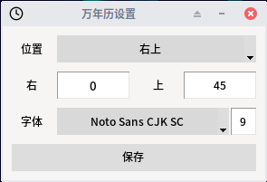

# xfce-lunar
适用于xfce桌面农历日历

### 安装
```
cd xfce-lunar
./install.sh
```

### 使用
- 在xfce面板上添加一般监视器
- 选择路径/home/${USER}/.xfce-lunar/lunar.sh   # ${USER}需要手动替换成你的用户名
- 去掉标签，周期选择1.00

### 注意
- 面板时间是两行，如果展示不下，请调整字体大小

### 展示


### 设置


- 位置分为左上、右上、左下、右下，选择对应的位置会出现对应的值，如：左上，下方会有到屏幕左边界和上边界的距离（单位px)
- 字体显示系统所有支持汉字的字体，可直接选择，其后是字体大小