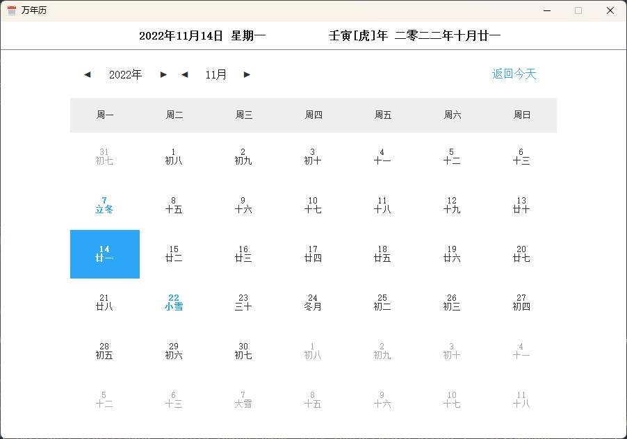

# xfce-lunar
桌面版本农历日历，支持Windows和Linux

### 依赖
```
python3-gi
```

### 运行
```
# win
python lunar.py
# linux
python3 lunar.py
```

### 展示



### 注意
- 在debian13/testing xfce4.20桌面下测试通过，理论上来说其他有python3环境的Linux桌面也可以使用。