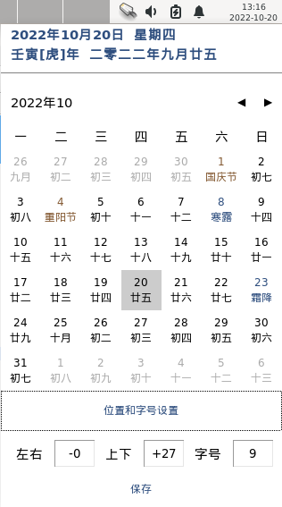

# xfce-lunar
适用于xfce桌面农历日历

### 依赖
```
python3-tk
```

### 安装
```
cd xfce-lunar
./install.sh
```

### 使用
- 在xfce面板上添加一般监视器
- 选择路径/home/${USER}/.xfce-lunar/lunar.sh   # ${USER}需要手动替换成你的用户名
- 去掉标签，周期选择1.00

### 注意
- 面板时间是两行，如果展示不下，请调整字体大小

### 展示



### 设置
- 设置包括左右、上下、字号3个，其中左右+为左、右为-，上为+、下为-，所以左和上使用正数，右和下使用负数；字号填写数字即可。

### 注意
- 仅在debian11/testing xfce4.16桌面下测试通过，理论上来说其他有python3环境的xfce桌面也可以使用。
